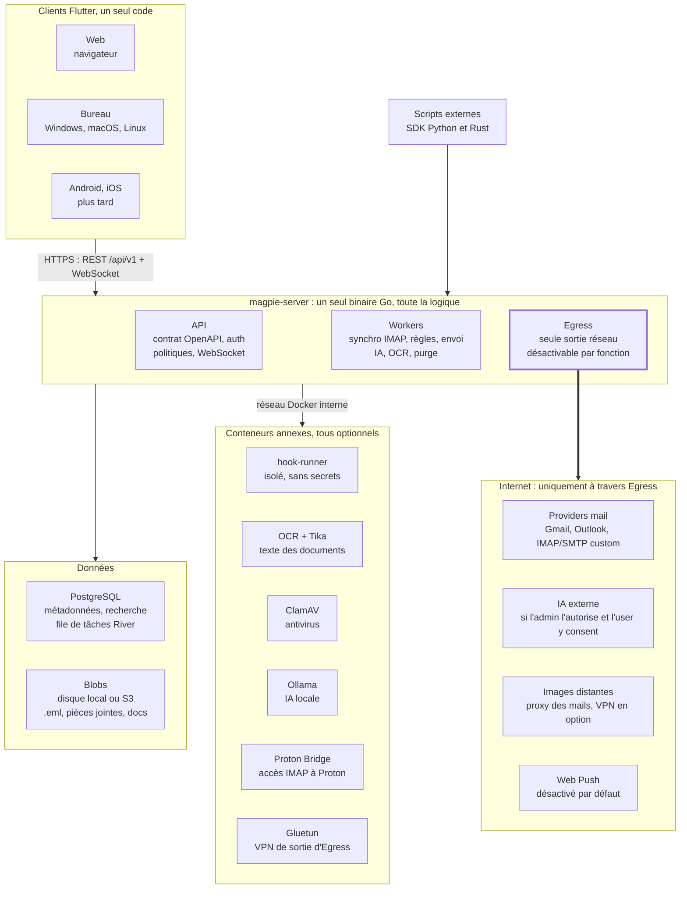

# MagpieMail — Plan d'exécution

*4 octobre 2026*

## Mode d'emploi

Ce plan se donne à l'agent un repo à la fois, une phase à la fois, avec une validation humaine à la fin de chaque phase. L'onglet « A — Serveur » sert au repo `magpiemail-server`, l'onglet « B — Client » au repo `magpiemail-client`. Chaque onglet est autonome ; cette vue d'ensemble fixe ce qui est commun aux deux.

1. Valider les choix de la section « Décisions à valider » (ou les modifier) avant toute ligne de code.
2. Exporter en Markdown cette vue d'ensemble et l'onglet du repo concerné, puis les placer dans `docs/plan/` du repo. Placer le `CLAUDE.md` fourni dans l'onglet à la racine du repo.
3. Lancer l'agent avec une consigne courte : « Exécute la phase S3 du plan ». Une phase = une branche = une pull request.
4. En fin de phase, l'agent coche chaque critère de validation avec une preuve (test, commande, capture), met à jour `docs/PROGRESS.md` et s'arrête pour revue.
5. Toute décision prise en cours de route est consignée dans un ADR (`docs/adr/NNNN-titre.md`).

Chaque phase suit le même gabarit, pensé pour qu'on sache sans ambiguïté si elle est finie :

- **Objectif** : le but en une phrase, vérifiable.
- **Dépend de** : les phases qui doivent être terminées avant.
- **Tâches** : ce que l'agent doit faire, dans l'ordre conseillé.
- **Livrables** : ce qui doit exister dans le repo à la fin.
- **Critères de validation** : la « Definition of Done ». Une phase n'est terminée que si tous sont prouvés.

Les phases sont regroupées en cinq jalons. Le jalon 2 est le MVP : à sa fin, on lit, trie, cherche et envoie ses mails de plusieurs comptes depuis un vrai client.

*Feuille de route : le MVP arrive au jalon 2 ; serveur et client avancent en parallèle. Une phase client avance contre le serveur simulé, puis se valide contre le vrai serveur.*

| Jalon | Serveur (`magpiemail-server`) | Client (`magpiemail-client`) |
| --- | --- | --- |
| **1 · Socle** sécurité, contrat, admin | S0 Fondations du repo S1 Contrat d'API et squelette HTTP S2 Données et stockage S3 Authentification S4 Administration et politiques | C0 Fondations du repo C1 Client d'API et serveur simulé C2 Spike du rendu HTML C3 Authentification C4 Coquille et navigation |
| **2 · MVP mail** lire, trier, chercher, écrire, être notifié | S5 Accounts et providers S6 Moteur de synchronisation S7 Lecture et anti-pistage S8 Dossiers globaux et tags S9 Composition et envoi S10 Temps réel et notifications S11 Recherche | C5 Accounts et providers C6 Listes et vues C7 Lecture C8 Composition C9 Recherche C10 Notifications et tray C11 Dossiers, tags, corbeille |
| ◆ **Jalon franchi : MVP** | MagpieMail sert au quotidien | |
| **3 · Automatisation** règles, hooks, IA | S12 Règles S13 Hooks, webhooks et SDK S14 Couche IA | C12 Règles et hooks C13 IA C14 Administration |
| **4 · Fonctions avancées** PGP, documents, calendrier, transferts | S15 PGP et antivirus S16 Mode Document S17 Calendrier et contacts S18 Import et export | C15 PGP et sécurité C16 Mode Document C17 Calendrier et contacts C18 Import et export |
| **5 · Release** durcir, documenter, livrer | S19 Durcissement et release | C19 Durcissement et release |
| ◆ **Jalon franchi : v1.0.0** | Serveur et client publiés | |

Les deux colonnes sont indépendantes : une phase client démarre dès que le contrat contient les tags dont elle a besoin, sans attendre que le serveur les implémente.

## Clarifications et corrections des notes

Les notes tiennent la route ; une vingtaine de points demandaient une interprétation ou une correction, et ce sont ces versions que le plan applique. Si une interprétation est fausse, corrige la ligne ici avant de lancer l'agent.

| Dans les notes | Ce que le plan retient |
| --- | --- |
| « Flutter ou Dart (je crois) » | Flutter est le framework d'interface, Dart son langage. Un seul code couvre Web, Windows, macOS, Linux, Android et iOS. Point faible connu : l'affichage des mails HTML, testé dès la phase C2. |
| Gmail / Outlook « sans mdp/token » | OAuth 2.0 (mécanisme XOAUTH2 sur IMAP/SMTP) : le serveur garde un jeton de rafraîchissement chiffré, jamais le mot de passe. En auto-hébergé, l'admin crée sa propre application OAuth chez Google et Microsoft ; la doc l'explique pas à pas. Outlook.com n'accepte plus l'authentification par mot de passe en IMAP. |
| Proton | Proton n'expose pas d'IMAP direct. Il faut Proton Mail Bridge (offres payantes), lancé en conteneur à côté du serveur ; MagpieMail le voit comme un compte IMAP/SMTP. |
| « Ajout de provider custom via édition config » | Un catalogue de providers en YAML (hôtes, ports, TLS, méthode d'auth), modifiable par fichier et par l'API admin. Les providers intégrés sont simplement des entrées pré-remplies de ce catalogue. |
| « BDD PostGre ou autre plus adaptée pour les fichiers » | PostgreSQL pour les métadonnées. Les fichiers (mails bruts .eml, pièces jointes, documents) vont dans un stockage de blobs : disque local par défaut, S3-compatible en option, adressés par empreinte SHA-256 pour dédupliquer. |
| « Voir si ça vaut le coup de mettre Elastic » | Pas au départ. La recherche plein texte de PostgreSQL suffit pour quelques utilisateurs et quelques centaines de milliers de mails. La recherche passe par une interface, pour brancher Meilisearch ou OpenSearch plus tard si les mesures le justifient. |
| « Modèles d'OCR en Docker comme Elastic » | Elasticsearch est un moteur de recherche, pas un OCR. OCR : Tesseract via OCRmyPDF dans un conteneur dédié (l'approche de Paperless-ngx). Texte des fichiers bureautiques : Apache Tika. |
| « Charger le contenu HTML depuis un endroit distant pour éviter les fuites d'IP » | Le client ne contacte jamais Internet. Le serveur nettoie le HTML, retire les traqueurs et sert les images distantes via son propre proxy, comme Gmail. Ce proxy peut sortir par un VPN (Gluetun). |
| « Serveur autosuffisant, aucun échange hors serveur et providers » | Tout appel sortant passe par un seul module « egress », journalisé et désactivable par fonction : IA externe, Web Push, recherche de clés PGP, proxy d'images. |
| « Notification toast même en version Web » | Toasts dans l'application via WebSocket quand le client est ouvert : aucun tiers. Onglet fermé, il faut le Web Push, qui transite par le service du navigateur (Google, Mozilla, Apple) : contenu chiffré, métadonnées visibles. Donc désactivé par défaut. |
| « Le moins de données stockées sur le client » | Toute la logique et les données vivent sur le serveur ; le client garde au plus un cache chiffré, vidé à la déconnexion. Conséquence : pas de vrai mode hors ligne (à confirmer). |
| « Récupération des mails en background » + « max de sécurité » | Pour synchroniser sans l'utilisateur, le serveur doit pouvoir déchiffrer les identifiants des comptes seul. Ils sont donc chiffrés avec une clé maître du serveur, pas avec le mot de passe de l'utilisateur. |
| « Dossiers globaux » | Des dossiers propres à MagpieMail, qui acceptent des mails de n'importe quel compte. Y ranger un mail ne le déplace pas chez le provider, sauf si la synchro des déplacements est activée pour ce compte. |
| Règles de tri « avec support Regex » | Expressions régulières évaluées par un moteur à temps linéaire (RE2) : une regex mal écrite ne peut pas bloquer le serveur. |
| Hooks : scripts créés par l'utilisateur | Un script utilisateur exécuté sur le serveur, c'est de l'exécution de code arbitraire. Les hooks tournent dans un conteneur isolé : pas de secrets, réseau coupé par défaut, CPU, mémoire et durée limités, accès à MagpieMail par un jeton API restreint. |
| L'IA peut déclencher des hooks | Un mail est du contenu non fiable : il peut contenir des instructions cachées pour l'IA (injection de prompt). L'IA n'appelle qu'une liste blanche de hooks, les actions sensibles demandent une confirmation, et tout est journalisé. |
| IA « comme T3Code » (Claude, Codex) | T3 Code pilote les CLI officielles installées sur la machine avec l'abonnement de l'utilisateur. Un serveur qui traite des mails automatiquement fait un usage programmatique, dont les règles d'abonnement ont changé plusieurs fois en 2026 ([exemple](https://the-decoder.com/claude-subscriptions-get-separate-budgets-for-programmatic-use-billed-at-full-api-prices/)). Par défaut : clés API et endpoints compatibles OpenAI ; l'adaptateur « CLI » reste optionnel et expérimental. |
| « Réponse avec le destinataire comme émetteur » | Gestion des identités : chaque compte a une ou plusieurs adresses (alias). En réponse, l'expéditeur par défaut est l'identité qui a reçu le mail (To, Cc, Delivered-To), sinon l'identité par défaut du compte. |
| « Options d'impôt et d'export » | Import et export. Formats : EML, MBOX, Maildir, PST (import seul), archive ZIP complète, et copie directe vers un autre compte IMAP. |
| « Analyse antivirus » | ClamAV (conteneur clamd) en option, et un hook custom comme alternative, comme dans les notes. |
| « Anglais » | Application en anglais uniquement, mais textes externalisés dès le départ : ajouter le français plus tard ne demandera qu'un fichier de traduction. |

## Ajouts suggérés

Onze fonctions absentes des notes sont intégrées au plan, parce qu'un client mail sérieux ne s'en passe pas ou parce que la sécurité les impose. Retire une ligne si tu n'en veux pas, et la phase correspondante s'allège d'autant.

| Ajout | Pourquoi | Phases |
| --- | --- | --- |
| Carnet d'adresses (contacts, synchro CardDAV, autocomplétion) | Indispensable pour composer ; alimente aussi les règles (« expéditeur connu ») | S17 · C17 |
| Identités, alias et signatures par compte | Nécessaires à la « réponse intelligente » des notes | S5, S9 · C5, C8 |
| Spam et désinscription | Respecter le dossier spam du provider, signaler spam / non-spam, désinscription en un clic (en-tête List-Unsubscribe) | S8 · C11 |
| Alertes anti-hameçonnage | Afficher le résultat SPF / DKIM / DMARC, signaler un nom affiché trompeur ou un domaine ressemblant | S7 · C7 |
| Annulation d'envoi | Quelques secondes pour rattraper un envoi ; même mécanisme que les mails programmés | S9 · C8 |
| Corbeille et rétention | Suppression réversible, purge planifiée, durée de conservation réglable | S8 · C11 |
| Journal d'audit | Connexions, actions admin, appels sortants : la preuve du « privacy & security first » | S3 · C14 |
| Jetons d'API personnels | Indispensables aux SDK Python et Rust et aux hooks | S3, S13 · C12 |
| Quotas par utilisateur | Stockage et consommation IA, réglés par l'admin | S4 · C14 |
| Sauvegarde et restauration du serveur | Base + blobs + clé maître ; sans la clé, les identifiants sont perdus | S19 |
| Accessibilité, raccourcis clavier, thème sombre | Qualité de base d'une application de bureau | C4, C19 |

## Architecture et contrat entre les deux repos

Le serveur porte toute la logique et toutes les données ; les clients ne sont que des interfaces qui parlent à une API publique. Les deux repos ne partagent qu'une chose : le contrat d'API.

*Architecture : les clients ne parlent qu'au serveur, et seul Egress sort sur Internet.*

Seul le serveur touche aux données et au réseau : clients et scripts passent par l'API, et tout appel vers Internet traverse Egress, éventuellement par le VPN Gluetun.

**Le contrat.** C'est le fichier `api/openapi.yaml` (OpenAPI 3.1) du repo serveur. Il est écrit avant le code de chaque domaine (« contract-first ») et versionné en semver ; chaque version publiée porte un tag `api-vX.Y.Z`.

- Le client embarque une copie figée de ce fichier (`api/openapi.yaml` + `api/VERSION`) et en génère son code d'accès. Il ne lit jamais le code du serveur.
- Tant qu'un endpoint n'est pas codé côté serveur, le client développe contre un serveur simulé généré depuis le contrat (Prism). C'est ce qui rend les deux parties indépendantes.
- Dans `/api/v1`, on ne fait qu'ajouter : un changement cassant ouvre `/api/v2`. Erreurs au format RFC 9457 (`application/problem+json`), pagination par curseur, dates en UTC ISO 8601.
- Chaque domaine a son tag OpenAPI (`auth`, `admin`, `accounts`, `mailboxes`, `messages`, `drafts`, `search`, `tags`, `folders`, `rules`, `hooks`, `ai`, `pgp`, `documents`, `calendar`, `contacts`, `transfer`, `events`). Les phases client citent ces tags.
- Les événements temps réel (WebSocket `/api/v1/events`) ont une enveloppe commune `{id, type, occurredAt, data}` décrite dans le même contrat.

## Décisions à valider avant de lancer l'agent

Le plan tourne avec les choix par défaut ci-dessous ; l'agent les inscrit en ADR à la phase 0 de chaque repo. Change une ligne ici plutôt qu'en cours de route : changer de langage serveur après S5 coûte une réécriture.

| Décision | Choix par défaut | Alternative crédible | Pourquoi ce choix |
| --- | --- | --- | --- |
| Langage du serveur | Go (dernière version stable) | Rust (Axum), Python (FastAPI) | Bibliothèques mail mûres (go-imap v2, go-message), PGP maintenu par Proton (gopenpgp), regex RE2 natives, centaines de connexions IMAP simultanées sans effort, binaire unique léger, compilation rapide pour les cycles TDD |
| Style d'API | REST + OpenAPI 3.1, contrat d'abord, code généré (oapi-codegen) | gRPC | Facile à appeler depuis un hook, un script ou un webhook ; SDK générables dans tous les langages |
| Base de données | PostgreSQL (dernière majeure), requêtes typées (sqlc), migrations (goose) | — | Recherche plein texte, JSONB pour les règles, fiabilité |
| Tâches de fond | River (file de tâches stockée dans PostgreSQL) | Redis + Asynq | Un service de moins à opérer et à sauvegarder |
| Stockage des fichiers | Disque local, S3-compatible en option | Tout en base | Les mails bruts et pièces jointes gonflent vite ; une base légère se sauvegarde mieux |
| Recherche | PostgreSQL plein texte + trigrammes | Meilisearch, OpenSearch | Zéro service en plus ; changement possible via une interface |
| Client | Flutter stable, Riverpod, go_router, client Dart généré | Tauri + web | Ton choix initial ; un seul code pour toutes les plateformes |
| Rendu des mails HTML | Décidé après le spike C2 (iframe isolée sur web, webview sur bureau et mobile) | Rendu natif Flutter | C'est le plus gros risque technique du client |
| Plateformes client | Web + bureau (Windows, macOS, Linux) d'abord, mobile ensuite | Toutes en même temps | L'icône de tray et la productivité visent le bureau |
| IA par défaut | Ollama local avec un petit modèle ; adaptateurs compatibles OpenAI et Anthropic | Fournisseur externe seul | Rien ne sort du serveur tant que l'admin ne l'a pas décidé |
| OCR et extraction | OCRmyPDF (Tesseract) + Apache Tika en conteneurs | Modèles d'OCR neuronaux | Éprouvé, léger, multilingue |
| Hooks | Conteneur isolé « hook-runner », Python et shell au départ | WebAssembly (Extism) | Simple à écrire pour l'utilisateur ; WebAssembly possible plus tard |
| Mode hors ligne | Non : cache minimal chiffré | Cache local complet | Cohérent avec « le moins de données sur le client » |
| Intégration continue | GitHub Actions (syntaxe compatible Forgejo / Gitea Actions) | GitLab CI | Le plus répandu |
| Licence | À choisir : AGPL-3.0 si tu veux que les forks hébergés restent ouverts, sinon Apache-2.0 | MIT | Décision de projet, pas technique |

## Langue et conventions communes

Tout ce qui entre dans un repo est en anglais ; tout ce que l'agent te dit est en français. Les deux `CLAUDE.md` fournis dans les onglets A et B reprennent ces règles pour l'agent.

**Langue**

- En anglais : code, identifiants, commentaires, messages de commit, descriptions de PR, README, docs, ADR, textes de l'interface, logs, messages d'erreur de l'API.
- En français : les échanges avec toi (questions, comptes rendus de fin de phase, propositions). Quand tu formules un besoin en français, l'agent le traduit en anglais dans le code et la doc.
- Seule exception : les fichiers de ce plan dans `docs/plan/` restent en français, c'est ta source.

**Méthode**

- TDD : test qui échoue, code minimal, refactorisation. Pas de logique métier sans test écrit avant.
- Pyramide de tests : unitaires, intégration avec de vrais services en conteneurs (Testcontainers), tests de contrat sur l'API, quelques tests de bout en bout.
- Une phase = une branche (`phase/S03-auth`) = une PR. Commits au format Conventional Commits (`feat(sync): …`).
- Formatage et analyse statique bloquants en CI. Versions en semver, `CHANGELOG.md` au format Keep a Changelog.

**Règles techniques partagées**

- Identifiants UUIDv7 (triables par date). Dates en UTC, format ISO 8601.
- Jamais de contenu de mail, de jeton ou de mot de passe dans les logs.
- Aucun secret dans le repo ; détection de secrets (gitleaks) et audit des dépendances en CI ; mises à jour de dépendances automatisées (Renovate).
- Définition de « terminé » commune : CI verte, critères de la phase prouvés, docs à jour, `docs/PROGRESS.md` à jour, aucun TODO sans ticket.

## Glossaire

Ces termes anglais sont les noms à utiliser tels quels dans le code, l'API et l'interface des deux repos.

| Terme | Sens |
| --- | --- |
| User | Personne qui se connecte à MagpieMail |
| Admin | User avec les droits d'administration du serveur |
| Capability | Droit accordé par l'admin à un user (ajouter un provider, utiliser l'IA, créer un hook…) |
| Provider | Fournisseur de mail du catalogue : Gmail, Outlook, Proton ou custom |
| Account | Boîte mail d'un provider connectée par un user |
| Identity | Adresse d'envoi d'un account (principale ou alias), avec sa signature |
| Sync policy | Réglages de synchronisation d'un account : quelles actions sont répercutées chez le provider |
| Mailbox | Dossier côté provider (INBOX, Sent, label Gmail…) |
| Global folder | Dossier propre à MagpieMail, qui accepte des messages de tous les accounts |
| View | Liste filtrée de messages : All, Unified Inbox, un account, un dossier, une recherche enregistrée |
| Message | Un mail : métadonnées en base, fichier brut .eml en blob |
| Thread | Conversation regroupée |
| Tag | Étiquette MagpieMail, répercutable en mot-clé IMAP ou label Gmail |
| Rule | Conditions + actions exécutées sur un événement (réception, envoi, manuel, planifié) |
| Hook | Script exécuté dans le conteneur isolé hook-runner |
| Webhook | Appel HTTP sortant signé vers une URL choisie |
| AI provider | Fournisseur d'inférence : local (Ollama…) ou externe |
| Document | Fichier indexé par le Mode Document (pièce jointe ou dépôt manuel) |
| Blob | Fichier stocké hors base, adressé par son empreinte SHA-256 |
| Egress | Tout trafic réseau sortant du serveur, toujours via le module dédié |
